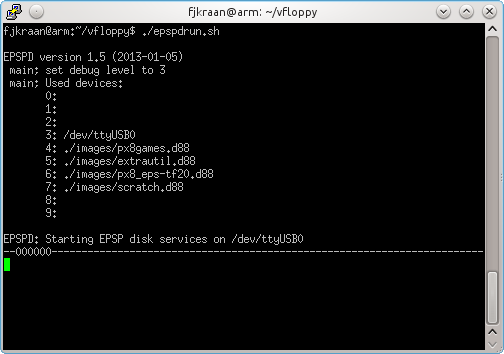
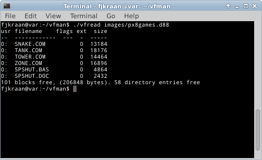

<H2>Intro</H2>

Vfloppy is a disk simulator for the Epson PX-4 and PX-8. It uses the
 epsp protocol used by the Epson TF-15, TF-20, PF-10 and compatible disk
 stations. It is written in C for Linux, and should be portable to any *nix
 with standard libraries, including even Windows. Apart from the program, 
 only a serial port and a cable to connect it to the PX-4 or PX-8  is needed.

<H2>Origin</H2>

The original version, written by Justin Mitchell and friends, consisted
only of a TF-15 simulator for the PX-4 and a formatter to create empty images. 
The floppy images were files containing only the sector information of the 
tracks 4 and up, as the lower tracks are not used by CP/M. This format uses 
the extension ".vfd".
<H2>Utilities</H2>

The versions 1.1 to 1.4 add support for the PX-8, and a read and write 
utility to transfer files between the images and the file system. Due to a 
bug, only file sizes below 32 kByte are supported by these utilities.
These versions of the utilities use functions which make them less ideal 
for porting to Windows.

See for more info the web site http://fjkraan.home.xs4all.nl/comp/px4/vfloppy/